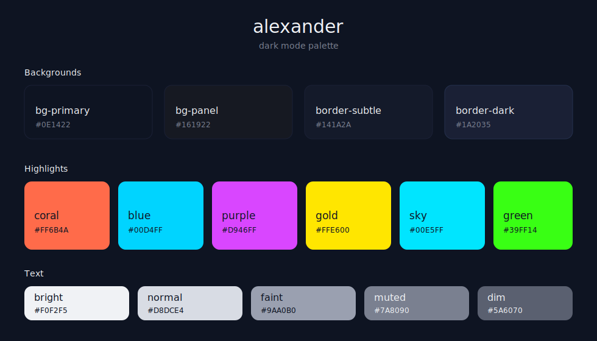

# alexander

Personal [OpenCode](https://opencode.ai) theme. Neon cyberpunk / Miami Vice type vibe. 

:chefkiss: 

## Preview



Dark mode with electric cyan, magenta, green, and yellow highlights on a deep navy background. Warm orange-red for errors and structural elements. Near-white text for readability.

## Colors

### Dark Mode

| Token | Hex | Usage |
|-------|-----|-------|
| `bg-primary` | `#0E1422` | Main background |
| `bg-panel` | `#161922` | Sidebar background |
| `coral` | `#FF6B4A` | Error, keywords, operators |
| `blue` | `#00D4FF` | Primary, syntax functions |
| `purple` | `#D946FF` | Accent, syntax types |
| `gold` | `#FFE600` | Warning, numbers |
| `sky` | `#00E5FF` | Info, syntax variables |
| `green` | `#39FF14` | Success, strings |
| `text-bright` | `#F0F2F5` | Primary text |
| `text-normal` | `#D8DCE4` | Secondary text |
| `text-muted` | `#7A8090` | Muted text |
| `text-dim` | `#5A6070` | Comments, subdued text |

[View full theme →](alexander.json)

## Installation

### Option 1: Copy the theme file

```bash
mkdir -p ~/.config/opencode/themes
cp alexander.json ~/.config/opencode/themes/
```

Then open OpenCode and run `/theme` to select **alexander**.

### Option 2: Clone the repo

```bash
git clone https://github.com/alexrudloff/alexander-oc-theme.git
cp alexander-oc-theme/alexander.json ~/.config/opencode/themes/
```

### Option 3: Direct download

Download [alexander.json](https://raw.githubusercontent.com/alexrudloff/alexander-oc-theme/main/alexander.json) and place it in `~/.config/opencode/themes/`.

## Requirements

- OpenCode >= latest
- Terminal with **truecolor** (24-bit) support

Check with: `echo $COLORTERM` - should output `truecolor` or `24bit`.

## License

MIT
